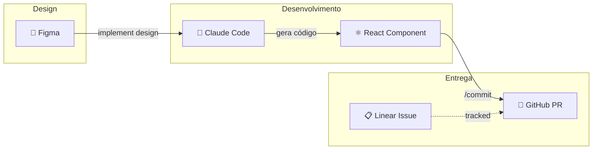

# Claude Code Workshop Demo

Projeto de demonstração do workshop de Claude Code - do design ao PR em minutos.

## Fluxo do Workshop



## Tech Stack

- React 19 + TypeScript
- Vite 7
- lucide-react (ícones)

## Comandos

```bash
npm run dev      # Servidor de desenvolvimento
npm run build    # Build de produção
npm run lint     # Verificar código
npm run preview  # Preview do build
```

## Recursos

- [Figma Design](https://www.figma.com/design/...) - Untitled UI